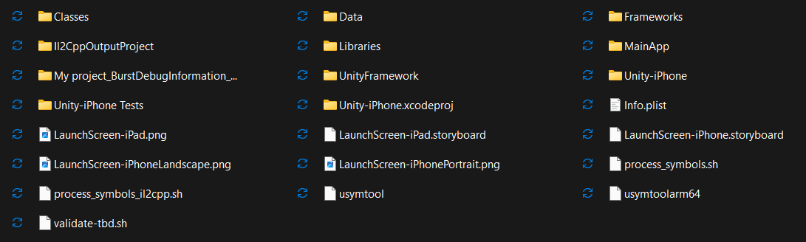

## iOs Deployment

Deze documentatie kan je gebruiken als je je Unity App wilt deployen op een iPad / iPhone.

Heb je nog geen Unity App of slaag je er niet in om te app zelf te kunnen builden, kijk dan eerst eens in de [unity_settings.md](./unity_settings.md) file.

**Benodigdheden** tijdens deze gids : een mac, een iPad / iPhone en een usb-c kabel om beide te verbinden.

## Windows naar Mac

Als de Unity App ontwikkelt is op een Mac, dan kan deze stap overgeslagen worden.

Als de app correct gebuild is zou je folderstructuur moeten hetzelfde zijn als de onderstaande folderstructuur

Jet moet zeker de map Unity-iPhone.xcodeproj hebben, anders is er iets misgelopen tijdens het builden.

Daarna moeten we de volledige folder krijgen op de Mac. De optie die wij gebruikt hebben is een .zip bestand maken, deze op google drive plaatsen en op de Mac inloggen op drive, en uiteindelijk de .zip van je drive halen en unzippen. Plaats deze map in de documenten folder op je Mac en niet in de downloads. Anders zou Xcode wel eens durven tegenstribbelen.

Dan open je de folder in Xcode, Xcode is standaard geïnstalleerd op Mac dus vereist niet nog een download. Eens de folder is ingeladen verbindt je de iPad met de Mac via usb-c. Bovenaan Xcode moet je dan een build target aanduiden en een target om de app op te zetten. 

Zorg ervoor dat je de Unity-iPhone probeert te builden en niet Unity Framework of een andere folder. Als je Unity Framework probeert te builden zal de build succeeden (als je geen errors hebt natuurlijk) maar zal er geen app tevoorschijn komen op de iPad.

Als je Unity-iPhone build succeed zou er app installatie moeten beginnen op de iPad. Daarna zal je eerst de app moeten verifiëren voor je deze kan opstarten. Voor te verifiëren ga je naar Instellingen > Algemeen > VPN- en apparaatbeheer, hier zou normaal je gebruikte Apple ID moeten staan en kan je de app verifiëren. Als het proces blijft draaien en je zit op campus- of eduroam, schakel dan even over naar je persoonlijke hotspot en probeer vervolgens opnieuw. 

Uiteindelijk zou je de app moeten kunnen opstarten en gebruiken. Wil je de iPad gebruiken tijdens een opendeurdag, dan kan je deze in Bbegeleide toegang zetten zodat gebruikers niet van de app weg kunnen gaan. Je schakelt deze in door naar Instellingen > Toegankelijkheid > Algemeen > Begeleide toegang > Aan. Om vervolgens deze dan in de app aan te zetten druk je driemaal snel na elkaar op de aan knop. Voor uit te zetten druk je opnieuw drie maal op de knop.

