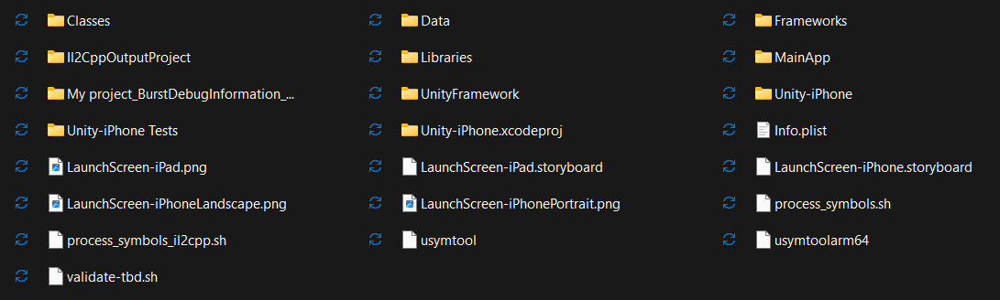
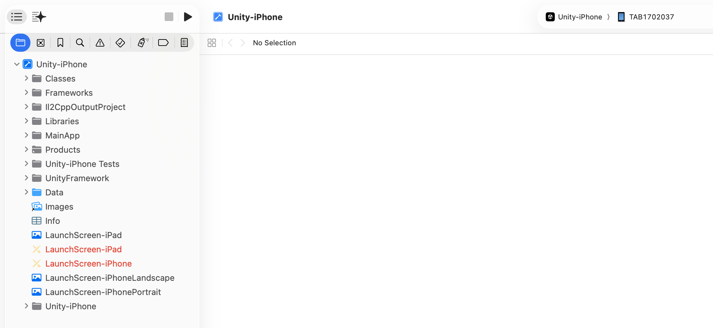
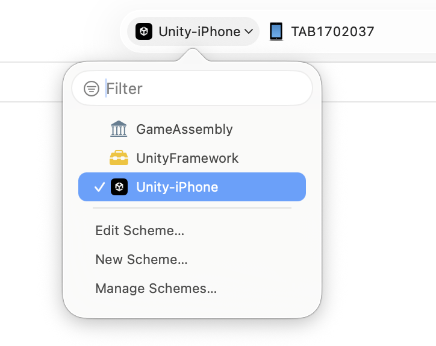
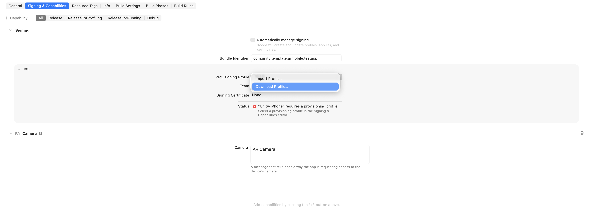
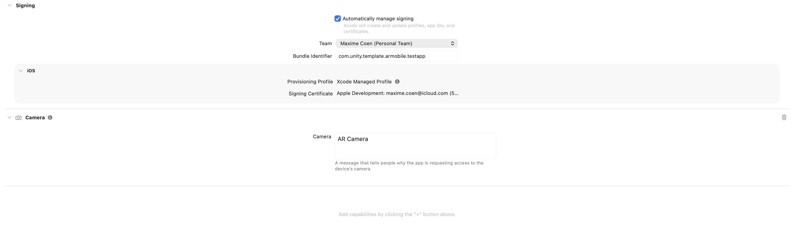
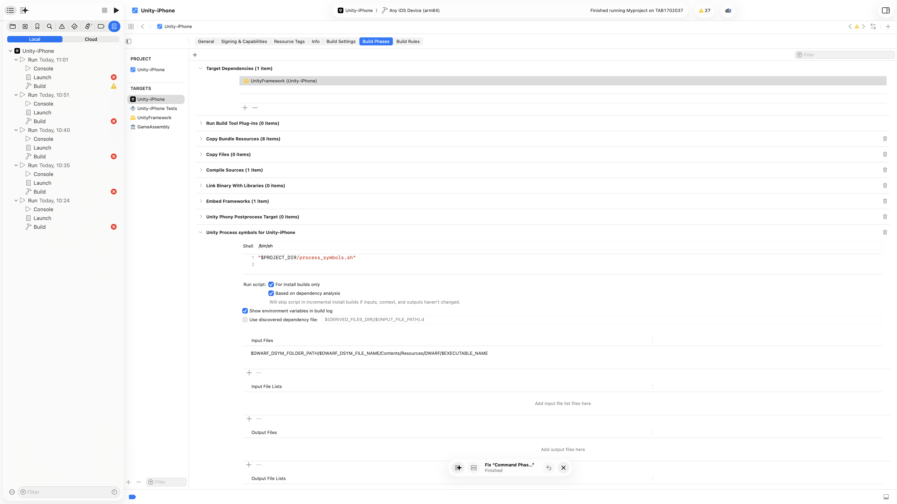

## iOs Deployment

Deze documentatie kan je gebruiken als je je Unity App wilt deployen op een iPad / iPhone.

Heb je nog geen Unity App of slaag je er niet in om te app zelf te kunnen builden, kijk dan eerst eens in de [unity_settings.md](./unity_settings.md) file.

**Benodigdheden** tijdens deze gids : een mac, een iPad / iPhone en een usb-c kabel om beide te verbinden.

## Windows naar Mac

Als de Unity App ontwikkelt is op een Mac, dan kan deze stap overgeslagen worden.

Als de app correct gebuild is zou je folderstructuur moeten hetzelfde zijn als de onderstaande folderstructuur



Je moet zeker de map Unity-iPhone.xcodeproj hebben, anders is er iets misgelopen tijdens het builden.

Daarna moeten we de volledige folder krijgen op de Mac. De optie die wij gebruikt hebben is een .zip bestand maken, deze op google drive plaatsen en op de Mac inloggen op drive, en uiteindelijk de .zip van je drive halen en unzippen. Plaats deze map in de documenten folder op je Mac en niet in de downloads. Anders zou Xcode wel eens durven tegenstribbelen.

## Project builden in Xcode

Dan open je de folder in Xcode, Xcode is standaard geïnstalleerd op Mac dus vereist niet nog een download. Eens de folder is ingeladen verbindt je de iPad met de Mac via usb-c (of over lightning als je met een oudere versie werkt). Bovenaan Xcode moet je dan een build target aanduiden en een target om de app op te zetten. 



Zorg ervoor dat je de Unity-iPhone probeert te builden en niet Unity Framework of een andere folder. Als je Unity Framework probeert te builden zal de build succeeden (als je geen errors hebt natuurlijk) maar zal er geen app tevoorschijn komen op de iPad.



Voor dat we ons project kunnen builden moeten we eerst nog een provisioning profile selecteren. Dit profiel is een soort van paspoort die vereist is om je app of een fysiek apparaat te laten draaien. Je gaat daarvoor naar het tablad signing & capabilities. Het vakje 'Automatically manage signing' dient aangeduidt te worden. Dan moet je een team selecteren, zit je nog niet in een team moet je eerst je apple account toevoegen in de instellingen van Xcode.

<div style="text-align: center;">
     
    
</div>

Een andere error die we gekregen hebben is dat er een bestand mist over de PrivacyInfo, apple is heel strikt omtrent privacy en de build zal niet succeeden voor dit in orde is. Zoek het bestand dat een error geeft, selecteer het, druk op backspace en kies voor remove reference. Xcode kan ook een gelijkaardige error geven voor LaunchScreen-iPad en LaunchScreen-iPhone, je voert dezelfde stappen uit als hiervoor uitgelegd. Voor de bestanden terug te zetten dien je in de file explorer de .xml extensies te verwijderen van deze bestanden. Als dit gebeurd is kan je ze gewoon terug slepen naar hun originele folder.

Als het dan nog niet lukt en je krijgt een error die lijkt op ```Command PhaseScriptExecution failed with a nonzero exit code```, dan wil Xcode een bestand uitvoeren maar geen rechten heeft om het uit te voeren. Om het bestand te vinden ga je linksboven naar het laatste tekentje, het lijkt op een lijstje. Dan zoek je in de logs naar de naam van het bestand. Eens gevonden openen we de terminal, ```Command + spatie``` en tik je in terminal en druk je op enter. In de terminal voeren we ```chmod +x <Path/To/File>``` uit en dan kunnen we het bestand uit voeren.

Als je Unity-iPhone build succeed zou er app installatie moeten beginnen op de iPad. Daarna zal je eerst de app moeten verifiëren voor je deze kan opstarten. Voor te verifiëren ga je naar Instellingen > Algemeen > VPN- en apparaatbeheer, hier zou normaal je gebruikte Apple ID moeten staan en kan je de app verifiëren. Als het proces blijft draaien en je zit op campus- of eduroam, schakel dan even over naar je persoonlijke hotspot en probeer vervolgens opnieuw. 

Uiteindelijk zou je de app moeten kunnen opstarten en gebruiken. Wil je de iPad gebruiken tijdens een opendeurdag, dan kan je deze in begeleide toegang zetten zodat gebruikers niet van de app weg kunnen gaan. Je schakelt deze in door naar Instellingen > Toegankelijkheid > Algemeen > Begeleide toegang > Aan. Om vervolgens deze dan in de app aan te zetten druk je driemaal snel na elkaar op de aan knop. Voor uit te zetten druk je opnieuw drie maal op de knop.

## Warnings

Als je alle stappen hierboven hebt gevolgd geeft Xcode waarschijnlijk nog een twintigtal warnings. Hieronder leg ik uit hoe je ze kan oplossen (warnings hoeven niet opgelost worden, maar ik licht ze toch even toe, als je ze oplost versnelt de build tijd).

Een eerste warning is dat Xcode niet weet wanneer hij een bepaald scriptje moet uitvoeren. Hiervoor ga je naar je Targets > Build Phases > Unity Process symbols for Unity-iPhone.



Andere warnings zijn zaken zoals 'unused variable' (wat compleet genegeerd kan worden) en '...' is deprecated, wat betekent dat de techniek veroudert is, dit werkt wel maar gebruik in de toekomst iets anders.

Dan is er ook een reeks aan warnings (stuk of tien) die komen door een fout tijdens het generen van de zogenaamde dSYM-bestanden. Er is enkel wat debug informatie tekort en de module cache kan niet gevonden worden. Dit ligt aan het feit dat de app niet is gecompileerd op de Mac zelf.

De laatste warning is een over een 1024x1024 icoon dat mist, dit is niet noodzakelijk maar als je het wil oplossen ga je naar Images > AppIcon en voeg je 1024x1024 px foto toe in het juiste vakje.

