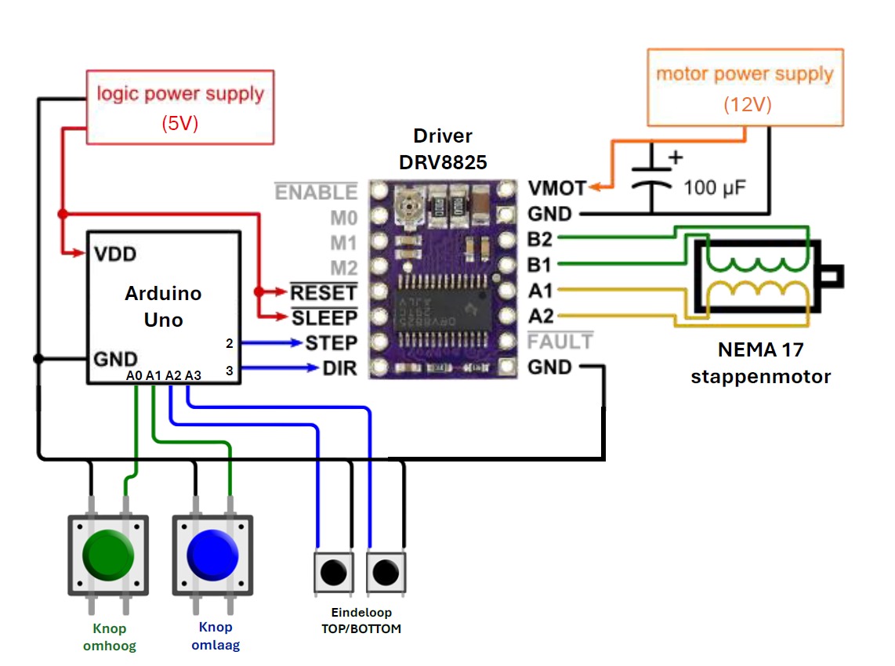
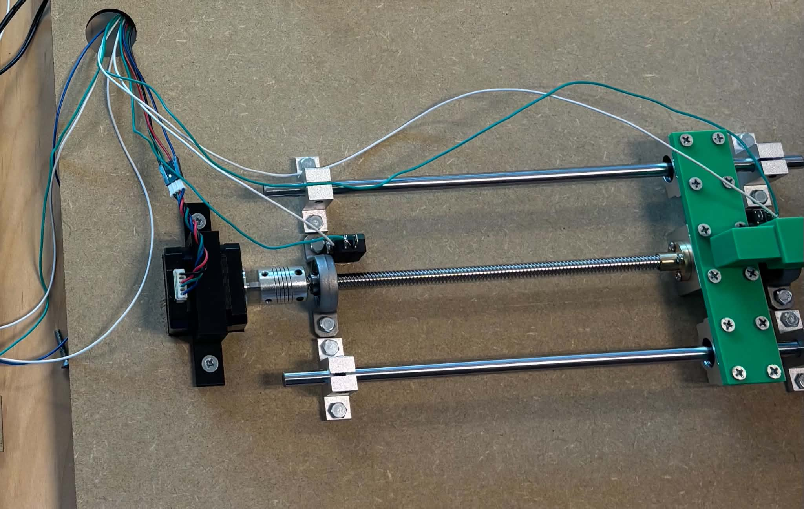
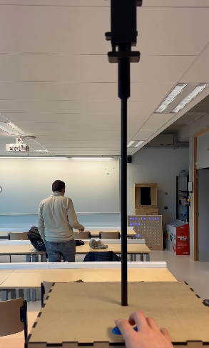

# Motor-systeem - Interactive Wall

Dit document beschrijft de fysieke en elektrische onderdelen en bouwstappen voor het stepper-motor aangedreven systeem. Gebruik [README.md](README.md) in deze map als referentie voor stijl en structuur.

---

## 1. Benodigde materialen en componenten

Hieronder staan de benodigde onderdelen voor de uitbreiding met de elektrische werking van de ipad.

### Elektrische en mechanische componenten

| Component | Hoeveelheid | Prijs |.
| :--- | :---: | ---: | --- |
| [Stepper motor](https://www.123-3d.nl/123-3D-NEMA17-stappenmotor-1-8-graden-per-stap-40-mm-lang-4-08-kg-cm-SL42S240A105-0524-i3421.html) | 1 | €13,50 |
| [Motor driver]([type](https://www.123-3d.nl/123-3D-Stepstick-DRV8825-stappenmotordriver-i96.html)) | 1 | €6,35 |
| [Voedingsadapter](https://www.allekabels.be/ac-dc-adapter/7207/1307581/acdc-adapter.html?mc=nl-be&gad_source=1&gad_campaignid=23389431341&gbraid=0AAAAAC3CB_okD0SKQMrVZA9-wxPausReL&gclid=CjwKCAjw8arQBhB9EiwAfIKdQppb90uKU8NKwPuhPW7Y_S4RznlXHUI-3nngYTxAewUgIViytcgq5BoC9CUQAvD_BwE) | 1 | €12,59 | 
| [arduino](https://www.123-3d.nl/123-3D-Arduino-Uno-Rev-3-clone-Arduino-compatible-i2286.html?utm_source=google&utm_medium=cpc&utm_campaign=PPC-SEA-NL-Google-Shopping-B-All-Segments-Parts-Electronics-CPA-02-00&gad_source=1&gad_campaignid=18925618742&gbraid=0AAAAAC164-QDrF7GzeNrhVDqncWMJ9kvG&gclid=Cj0KCQiA8KTNBhD_ARIsAOvp6DIiChWMlNo7wQswlYsGXGtb5-Uf0_ESEoJvM13B0mFs2YvTm7KTuc8aAugtEALw_wcB) | 1 | €16,00 |
| [Stekkerblok](https://www.allekabels.be/stekkerdoos/7069/4387750/stekkerdoos-penaarde.html?mc=nl-be&gad_source=1&gad_campaignid=23384480523&gbraid=0AAAAAC3CB_qtY4OpM5_-fprDxz_QA0sEq&gclid=CjwKCAjw8arQBhB9EiwAfIKdQuOT8Zny5DlwZA6k9oBzUDrMvzsZFRJcDZzGcQ7nEkw-VssDObl66hoCwPIQAvD_BwE) | 1 | €5,89 | 
| [USB-A](https://www.allekabels.be/stekkerdoos/7069/4387750/stekkerdoos-penaarde.html?mc=nl-be&gad_source=1&gad_campaignid=23384480523&gbraid=0AAAAAC3CB_qtY4OpM5_-fprDxz_QA0sEq&gclid=CjwKCAjw8arQBhB9EiwAfIKdQuOT8Zny5DlwZA6k9oBzUDrMvzsZFRJcDZzGcQ7nEkw-VssDObl66hoCwPIQAvD_BwE) | 1 | €8,59 |
| [as staaf set](https://be.vicedeal.com/products/as-staaf-set-t8-dual-lood-schroef-koppeling-lagers-ondersteuning-blok-kp08-scs8uu-cnc-deel-200-250-300-350-400-500mm-optische-as-1?gad_source=1&gad_campaignid=21267983978&gbraid=0AAAAA9WryfGzXXNNLLOqgyA4Q5ZerETsF&gclid=Cj0KCQiA8KTNBhD_ARIsAOvp6DLnkivRH18-CMoxPJWv9OJEdhqVvrrPXx8cTLfV__MeeH1a3XV9CywaAvMtEALw_wcB&variant=UHJvZHVjdFZhcmlhbnQ6ODMzMjA0NDQ3) | 1 | €59,39 | 
| [M5x20mm moer](https://www.rvspaleis.nl/bouten/binnenzeskant/ws-9335/ws-9335-[-]-a2-[-]-m5/9335-2-5x20_1?gad_source=1&gad_campaignid=22359118057&gbraid=0AAAAA-qqD0rRsCiAMIkC0rO-J42JnhjZ6&gclid=CjwKCAjw8arQBhB9EiwAfIKdQutTbv1kBjIYRPDGqiRJO7b9_LHKvkk9x-FkWhNVoBGSRA-U17GzuxoCg0UQAvD_BwE) | 14 | €0,25 |
| [M4x20mm](https://www.meubelbeslagxxl.nl/meubelgreep-schroef-m4x20mm-verzinkt-per-stuk?utm_source=google&utm_medium=cpc&utm_campaign=22488980808&campagnenaam=BE_SmartShopping_BER1.5-1.99&gad_source=1&gad_campaignid=22488981732&gbraid=0AAAAAqpB4ZGGFfGhuHOAYZdupbfWbsrbg&gclid=CjwKCAjw8arQBhB9EiwAfIKdQialVvts3u61pWQ70tkz4qwQE4XleLrCiEm0ewB63gqeQMiOWCppXRoC_FYQAvD_BwE)| 12 | €0,07 |
| [M3x10mm](https://www.rvspaleis.nl/bouten/buitenzeskant/din-933/din-933-[-]-a2/din-933-[-]-a2-[-]-m3/933-2-3x10_1?gad_source=1&gad_campaignid=22138139970&gbraid=0AAAAA-qqD0qdITVrx2k6MS822IN53Q2Lz&gclid=CjwKCAjw8arQBhB9EiwAfIKdQob09FlFBnQwPjgGvd8XTTRQznzboX6O4Wm2nhdu_zxfV5Bt4Rqe-RoCO5EQAvD_BwE) | 4 | €0,21 |

---

## 2. Elektrisch schema
Hieronder vind je het elektrisch schema van deze opstelling:

| Component | Pin op component | Naar Arduino / Voeding | Functie |
| --- | --- | --- | --- |
| DRV8825 Driver | STEP | Arduino Pin 2 | Stap-signaal (pulsen) |
| DRV8825 Driver | DIR | Arduino Pin 3 | Richting-signaal (omhoog/omlaag) |
| DRV8825 Driver | GND (Logic) | Arduino GND | Logische massa |
| DRV8825 Driver | SLP & RST | Met elkaar verbinden | Jumper/kabeltje om driver te activeren |
| DRV8825 Driver | VMOT | Externe Voeding (+) | 12V - 36V DC stroom voor de motor |
| DRV8825 Driver | GND (Power) | Externe Voeding (-) | Massa van de motorvoeding |
| DRV8825 Driver | A1, A2, B1, B2 | Draden stappenmotor | Spoelen van de FIT0278 motor |
| Knop Omhoog | COM | Arduino GND | Gemeenschappelijke massa |
| Knop Omhoog | NO | Arduino Pin A0 | Commando omhoog |
| Knop Omlaag | COM | Arduino GND | Gemeenschappelijke massa |
| Knop Omlaag | NO | Arduino Pin A1 | Commando omlaag |
| Eindeloop TOP | COM | Arduino GND | Gemeenschappelijke massa |
| Eindeloop TOP | NO | Arduino Pin A2 | Blokkeert beweging omhoog |
| Eindeloop BOTTOM | COM | Arduino GND | Gemeenschappelijke massa |
| Eindeloop BOTTOM | NO | Arduino Pin A3 | Blokkeert beweging omlaag |

---

## 3. Lasercutter- en 3D-printerbestanden

- lasercut bestanden
	- 2 veranderingen, de top veranderd en de achterkant veranderd
- 3D bestanden
	- Beugel voor stepper motor
	- Stang motor tussenstuk voor staaf in te steken

### Beschikbare bestanden

- **box_Drawing_motor Sheet1.dxf**: Volledige box met motor
	- Materiaal: MDF / 6mm
	- Afmetingen: 
	- Hoeveelheid: 1

- **Corner.stl**: Hoeken 
	- Materiaal: PLA
	- Hoeveelheid: 8

- **stang_motor_tussenstuk.stl**: Montage stuk stang 
	- Materiaal: PLA
	- Hoeveelheid: 1

- **beugel_stappenmotor.stl**: Beugel 
	- Materiaal: PLA
	- Hoeveelheid: 1
### Download & details

Alle bestanden bevinden zich in de map: [CAD-bestanden/Motor-systeem](CAD-bestanden/Motor-systeem/)

---

## 4. Arduino Broncode
De broncode voor Arduino is hier te vinden: [Code/px2_motor.ino](../Code/px2_motor.ino).

## 5. Technische Specificaties & Voedingen
In deze opstelling wordt gebruikgemaakt van twee gescheiden elektrische circuits: het logische circuit en het vermogenscircuit.

### A. Logische Voeding (Microcontroller & Driver Logica)
Spanning: 5 V DC.

Bron: Geleverd via de USB-kabel vanaf de computer of een externe 9V DC-adapter op de barrel-jack van de Arduino Uno.  

Stroomsterkte: De Arduino Uno verbruikt zelf circa 50–100 mA, maar kan maximaal 40 mA per I/O-pin leveren. Dit is ruim voldoende om de stuursignalen naar de driver te zenden.  

### B. Externe Vermogensvoeding (Voor de Stappenmotor)
De stappenmotor kan absoluut niet op de 5V-spanning van de Arduino draaien. Hiervoor is een krachtige externe voedingsbron vereist.  

Spanning: 12 V tot 36 V DC (een stabiele industriële voeding of adapter van 12V of 24V is aanbevolen). Hoewel de motor een nominale spanning van 2,55 V heeft, dwingt een hogere voedingsspanning (zoals 12V/24V) de stroom sneller door de spoelen, wat zorgt voor aanzienlijk meer koppel bij het omhoog bewegen van het gewicht.  

Stroomsterkte: Minimaal 1,5 A tot 2 A. De gebruikte NEMA17 stappenmotor heeft een nominale stroom van 1,2 A per fase. De voeding moet deze stroom continu kunnen leveren zonder in te zakken.

### CRUCIALE HARDWARE-INSTELLING (Vref): 
Voordat de motor volledig wordt belast, moet de kleine potmeter op de DRV8825 driver handmatig worden afgesteld. Meet de spanning (Vref) tussen de potmeter en de GND-pin met een multimeter en stel deze nauwkeurig in op 0,6 V. Hiermee wordt de stroom begrensd op de veilige 1,2 A van de motor om oververhitting of doorbranden te voorkomen

## 5. Stap-voor-stap bouwinstructies

Volg deze stappen om het motor-systeem te bouwen en te testen.

### Stap 1: Voorbereiding

- Controleer of alle onderdelen aanwezig zijn 
- Print of laser-cut alle benodigde onderdelen.

### Stap 2: Mechanische montage

- Monteer de T8 as-staaf set stevig op de middenplaat met behulp van de M5 x 20mm bouten en moeren. De gaten zitten al op je juiste plaats voorgeboord.  

- Bevestig de houder van het omhoog/omlaag bewegende blokje op het middelste loopblok met de M3 x 10mm bouten en moeren.  

- Monteer het stang_motor_tussenstuk op het middelste blok en de twee buitenste lineaire geleiders met de M4 x 20mm bouten.  

- Bevestig de beugel_stappenmotor rond de NEMA17 stappenmotor met de M5 x 20mm bouten op de middenplaat.  

- Koppel de motoras aan de T8 spindelstang met de flexibele koppeling. Draai de inbusboutjes stevig aan om slip te voorkomen.  

- Plaatsing Eindschakelaars: Bevestig de TOP en BOTTOM schakelaars met lijm op de plaat. Positioneer ze zo dat het loopblok de schakelaar volledig indrukt nét voordat het mechanisme het fysieke einde van de 30 cm stang raakt.

- Steek de stang in het midden stuk en plaats de plaat recht in de box. Aan de hand van de 8 3d-geprinte hoeken kan je deze plaat in de box bevestigen.

### Stap 3: Elektrische aansluiting

- Sluit de vier draden van de NEMA17 stappenmotor aan op de driver (1A, 1B, 2A, 2B) volgens de tabel in hoofdstuk 2.  

- Sluit de stuursignalen (STEP naar pin 2, DIR naar pin 3) en de logische GND aan op de Arduino Uno.

- Verbind de pinnen SLP en RST op de driver door middel van een kleine jumperdraad.

- Sluit de 4-pins drukknoppen aan op respectievelijk pin A0 en A1.

- Sluit de COM- en NO-pinnen van de eindschakelaars aan op pinnen A2 en A3.

- Beveiliging & Voeding: Sluit een condensator (bijv. 100µF) parallel aan over de VMOT (+) en GND (-) pinnen van de driver. Sluit daarna pas de draden van de externe 12V-36V voeding aan.

### Stap 4: Configuratie en testen

-Stroomlimiet instellen: Schakel de externe DC-voeding in. Meet met de multimeter de spanning op de potmeter van de driver en stel deze voorzichtig af op exact 0,6 V (Vref). Schakel de voeding daarna weer uit.  

- Firmware uploaden: Verbind de Arduino Uno via USB met de computer. Open de Arduino IDE, kopieer de broncode uit Hoofdstuk 4 en upload deze naar het board.  

- Richting- en Eindelooptest: Schakel de externe voeding weer in. Druk op de knop 'Omhoog'. Als de motor de verkeerde kant op draait, wissel dan in de code HIGH en LOW om bij de dirPin. 

- Houd de omhoog-knop ingedrukt en activeer handmatig de TOP-eindschakelaar met je vinger. De motor moet onmiddellijk stoppen. Herhaal deze procedure voor de omlaag-richting en de BOTTOM-schakelaar.

### Stap 5: Finalisatie

- Breng het meegeleverde aluminium koelblokje aan op de DRV8825 driver chip met de zelfklevende strip.

- Bind alle loshangende kabels netjes samen met kabelbinders (tie-wraps) buiten het bereik van de draaiende 30 cm spindelstang.

---

## 6. Resultaat

- Het systeem beweegt de rails soepel met ingestelde stappen/mm.
- Homing werkt betrouwbaar met eindschakelaars.

