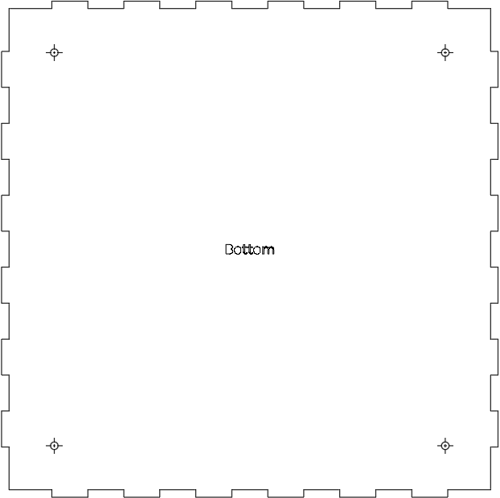
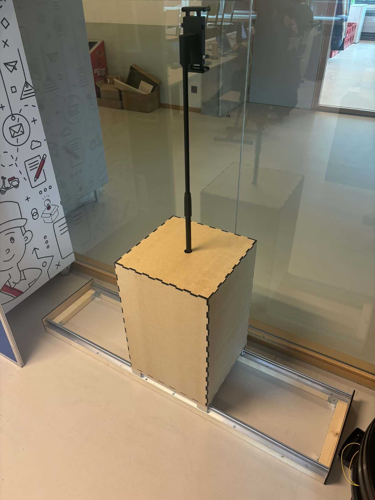

# Fysieke constructie - Interactive Wall

Dit document beschrijft de volledige fysieke constructie van het Interactive Wall-systeem. Hier vind je alle informatie die nodig is om het frame en de fysieke componenten zelf te bouwen.

---

## 1. Benodigde materialen en componenten

Hieronder vind je een volledige lijst van alle materialen en componenten die we hebben gebruikt, inclusief links naar de producten.

### Materialen voor de constructie

| Materiaal | Hoeveelheid | Prijs |
| :--- | :---: | ---: |
| [Lineaire geleiderail](https://www.vevor.nl/lineaire-geleiderail-c_45317/vevor-lineaire-geleider-lineaire-rail-2-stuks-sbr20-1500mm-koolstofstaal-aluminium-geleiderail-met-4-stuks-sbr20uu-glijblokken-lineaire-lagerlagerblok-cnc-onderdelen-voor-3d-printer-freesdraaibank-p_010340680230)| 2 | € 64.99 |
| [Tablethouder](https://www.conrad.be/nl/p/my-wall-hz51l-adapter-voor-tablethouder-11-9-cm-4-7-38-1-cm-15-3314698.html) | 1 | € 16.99 |
| [Vonyx MS100B microfoonstandaard](https://www.maxiaxi.com/vonyx-ms100b-microfoonstandaard-in-hoogte-verstelbaar-zwart/?utm_source=beslist&utm_medium=cpc&utm_campaign=beslist&bl3nlclid=983d09c5-7bcc-4e01-aef6-ad41a3be07ba&utm_term=BESLI983d09c5-7bcc-4e01-aef6-ad41a3be07ba) | 1 | € 35.00 |
| [Houten balk 2.1m](https://www.hubo.be/nl/p/vurenhout-geschaafd-44x44-mm-210cm/20865/) | 2 | € 6.91 |
| [Houten plaat 9mm](https://www.hubo.be/nl/p/mdf-plaat-244x122-cm-9mm/2694/) | 1 | € 22.99 |
| [Versterkingshoek 40x40x40mm](https://www.brico.be/nl/ijzerwaren/montage-bouwbeslag/hoekijzers-verbindingsplaten/hoekankers/alberts-versterkingshoek-verzinkt-staal-gelijkbenig-40x40x40mm/10022635) | 4 | € 1.60 |
| [Schroeven 5x30mm](https://www.brico.be/nl/ijzerwaren/technische-bevestigingsmaterialen/schroeven/universele-schroeven/spax-universele-schroef-t-star-wirox-verzonken-kop-torx-t20-5x30mm-50-stuks/5354459) | 1 | € 8.70 |
| [Schroeven 3.5x20mm](https://www.brico.be/nl/ijzerwaren/technische-bevestigingsmaterialen/schroeven/universele-schroeven/spax-universele-schroef-ronde-kop-3-5x20mm-20-stuks/0877174) | 1 | € 3.49 |
| [Bouten M4x20mm](https://www.brico.be/nl/ijzerwaren/technische-bevestigingsmaterialen/bouten/slotbouten/sencys-metaalschroef-staal-m4x20-mm/5367446) | 1 | € 4.69 |
| [Bouten M6x25mm](https://www.brico.be/nl/ijzerwaren/technische-bevestigingsmaterialen/bouten/zeskantbouten/sencys-zeskantbout-met-moer-staal-gegalvaniseerd-m6x25-mm/5367660) | 1 | € 3.99 |
| [MDF-plaat 6mm](https://www.brico.be/nl/hout-ramen-trappen-deuren/hout/houten-platen/mdf-platen/mdf-plaat-fibromax-244x122cm-6mm/1887975) | 2 | € 25.50 |

### Hardwarecomponenten

| Component | Hoeveelheid | Prijs |
| :--- | :---: | ---: |
| Links | Midden | Rechts |

---

## 2. Lasercutter- en 3D-printerbestanden

In deze sectie vind je alle bestanden die gebruikt zijn om onderdelen van het frame met de lasercutter uit te snijden.

### Beschikbare bestanden

- **Remplaat_Drawing**: remplaatjes voor de rail
  - Materiaal: MDF-plaat 6mm
  - Hoeveelheid: 2

- **box_px2**: box voor de motor
  - Materiaal: MDF-plaat 6mm
  - Hoeveelheid: 1
  - Opmerking: Verwijder zelf de tekst (zoals bottom) en de kruisjes op de gaten als je die niet wilt.

- **Tussenstuk_ipadhouder2**: tussenstuk dat de iPad-houder aan de stang koppelt
  - Materiaal: PLA (zwart)
  - Hoeveelheid: 1

### Download & details

Alle bestanden bevinden zich in de map: [CAD-bestanden](CAD-bestanden/)

---

## 3. Stap-voor-stap constructie-instructies

Volg de volgende stappen om het frame stap voor stap op te bouwen.

### Stap 1: Voorbereiding en onderdelen controleren

Zorg dat je alle materialen hebt aangeschaft die in de tabel van deze README staan. Zorg er ook voor dat je alle onderdelen die gelaserd of 3D-geprint moeten worden, klaar hebt liggen. Zodra dat in orde is, kan je starten met monteren.

### Stap 2: Frame voor de rails

Om de twee rails naast elkaar op hun plaats te houden, maken we hieronder een frame. Hiervoor heb je de **twee houten balken van 2,1 m** nodig.

Uit beide balken haal je een stuk van 1,5 m en een kleiner stuk van 30,9 cm.
Nu zou je moeten hebben:
- 2 x 1,5m
- 2 x 30,9cm

De balken van 1,5 m passen perfect onder de twee rails. Je kan deze vastmaken met de **5x30 mm schroeven**. Per rail gebruik je 10 schroeven om alles aan elkaar te bevestigen.

De balken van 30,9 cm passen tussen de uiteinden van de lange balken en worden gemonteerd met de versterkingshoeken van **40x40x40**. Per versterkingshoek gebruik je 4 schroeven van **5x30 mm**. Je monteerd deze versterkinghouken allemaal aan de binnenkant van het frame.

Aan de uiteinden van de rails plaats je een stop, die je in de CAD-bestanden kan terugvinden, en monteer je die op elk uiteinde van het frame. De 5 nodige gaten zijn al voorzien. Gebruik hiervoor de **3,5x20 mm** schroeven.

### Stap 3: Grondplaat en box

Uit de **houten plaat van 9 mm** zaag je een plaat van 40 cm op 40 cm. Dit is een stevige grondplaat waarop de box later bevestigd kan worden. Je kan de gaten aftekenen door de onderste plaat van de box erop te leggen, de 4 gaten over te nemen en ze daarna handmatig te boren.

Als de gaten ook in deze plaat zitten, kan je de twee platen op elkaar leggen en vastmaken aan de 4 glijblokken. Die zouden moeten overeenkomen met het binnenste gat van elk glijblok. Daarna kan je de twee platen vastzetten met 4 **M6x25 mm bouten**.

De andere platen van de box passen perfect in elkaar. Als alles correct geplaatst is, kan je de platen vastlijmen zodat het een stevig geheel wordt.

### Stap 4: Stang voor tablet

Het geprinte tussenstuk zou perfect moeten passen op de Vonyx MS100B microfoonstandaard. Je kan het bovenste metalen stukje eraf draaien en in het tussenstuk duwen, zodat je dit tussenstuk daarna opnieuw stevig op de stang kan vastdraaien.

Nu kan je de **tablethouder** met 2 **M4x20 mm bouten** vastmaken aan het tussenstuk, zodat je de tablet op de stang kan klikken.

## Resultaat

Dit is het resultaat dat je zou moeten bekomen na het uitvoeren van al deze stappen:

